Hi!
Those are various icons that I made some months ago, some are unfinished/duplicated.
[Download all icons (.zip)](all%20obsidian%20icons.zip) (click this link and select "download RAW file" to download zip with all icons).
| no. | icon | name |
| :--- | :---: | :--- |
| 1 |  | 1.4.1.png |
| 3 | 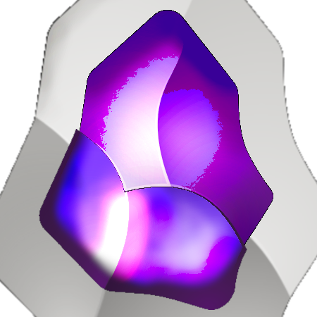 | biale2.1.png |
| 5 |  | białe1.10.png |
| 6 | 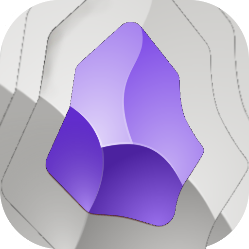 | białe1.11.png |
| 7 | 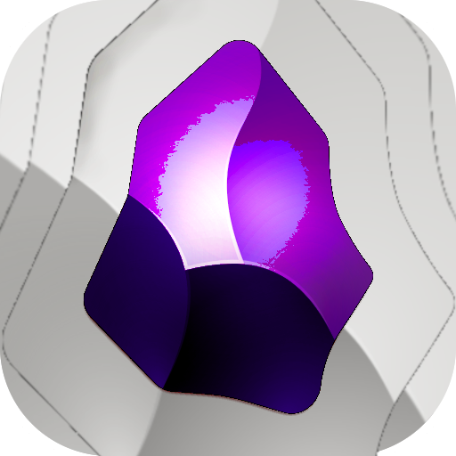 | białe1.12.png |
| 14 | 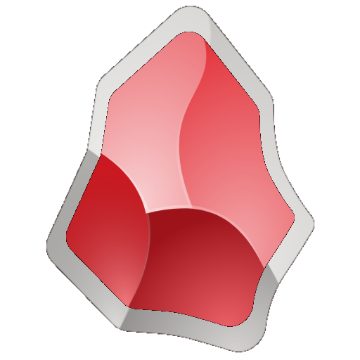 | białe1.1.png |
| 15 |  | białe1.2.png |
| 16 | 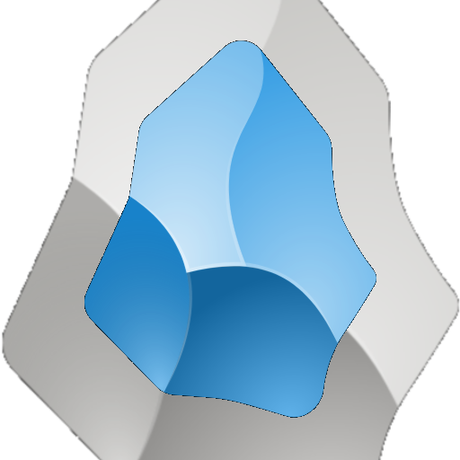 | białe1.3.png |
| 17 |  | białe1.4.png |
| 18 |  | białe1.5.png |
| 19 | 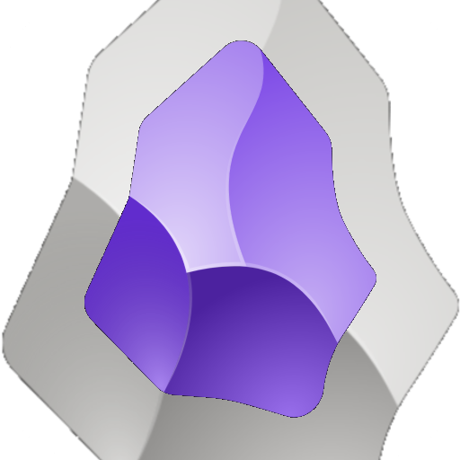 | białe1.6.png |
| 20 | 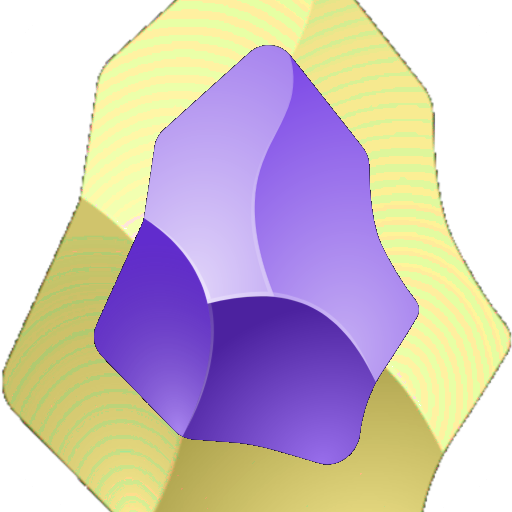 | białe1.7.png |
| 21 | 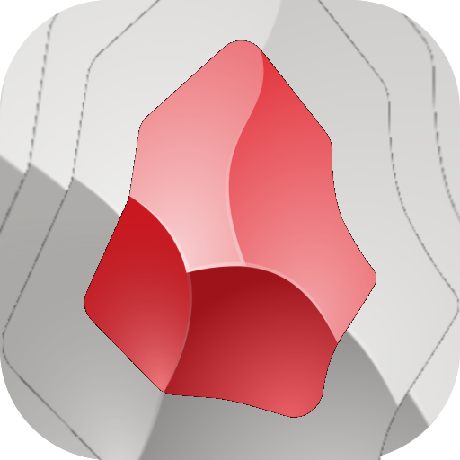 | białe1.8.png |
| 22 |  | białe1.9.png |
| 27 |  | limonka krawędzie1.png |
| 28 |  | limonka przez3.png |
| 31 |  | niebieski przezroczysty1.png |
| 32 | 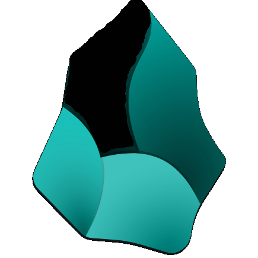 | obsczarny1.png |
| 33 |  | Obsidian 1.1 test gimp1.png |
| 34 |  | Obsidian 1.1 test gimp2.1.png |
| 35 |  | Obsidian 1.1 test gimp2.2.png |
| 36 |  | Obsidian 1.1 test gimp2.3.png |
| 37 |  | Obsidian 1.1 test gimp2.4.png |
| 38 |  | Obsidian 1.1 test gimp2.5.png |
| 39 |  | Obsidian 1.1 test gimp2.6.png |
| 40 |  | Obsidian 1.1 test gimp2.7.png |
| 41 |  | Obsidian 1.1 test gimp2.8.png |
| 42 |  | Obsidian 1.1 test gimp2.9.png |
| 43 |  | Obsidian 1.1 test gimp2.png |
| 44 |  | Obsidian App Icon.png |
| 45 |  | obsidian fioletowy alternatywny odwrócony z limonki2.png |
| 46 |  | obsidian fioletowy alternatywny odwrócony z limonki.png |
| 47 |  | obsidian teal 2.png |
| 48 |  | obsidian-icon.png |
| 49 |  | plaski10.png |
| 50 |  | plaski11.png |
| 51 |  | plaski12.png |
| 52 |  | plaski13.png |
| 53 | 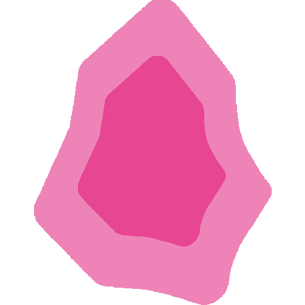 | plaski14.png |
| 54 | 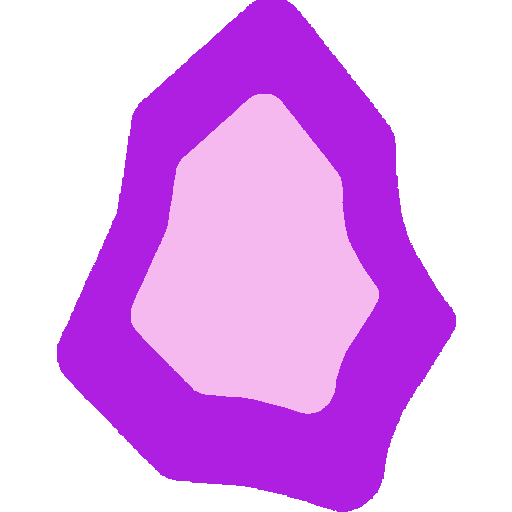 | plaski15.png |
| 55 | 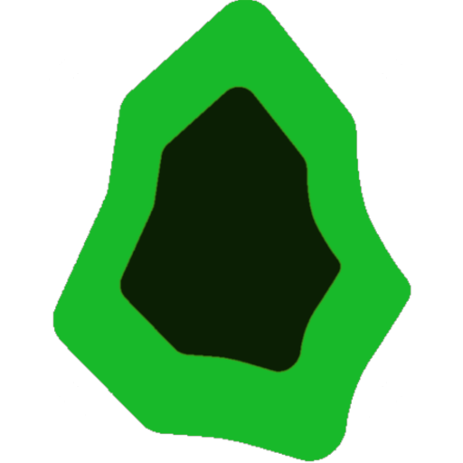 | plaski16.png |
| 56 | 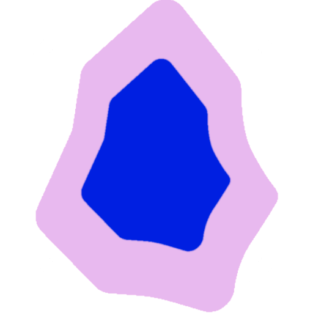 | plaski17.png |
| 57 | 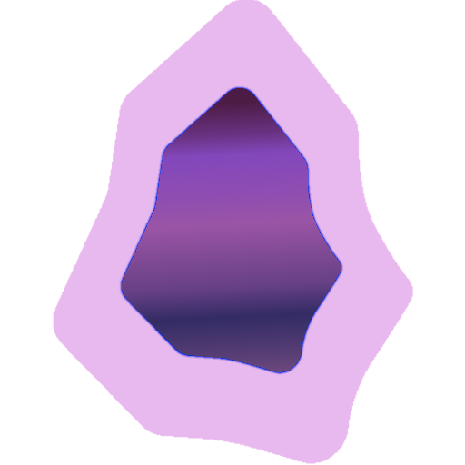 | plaski18.png |
| 58 | 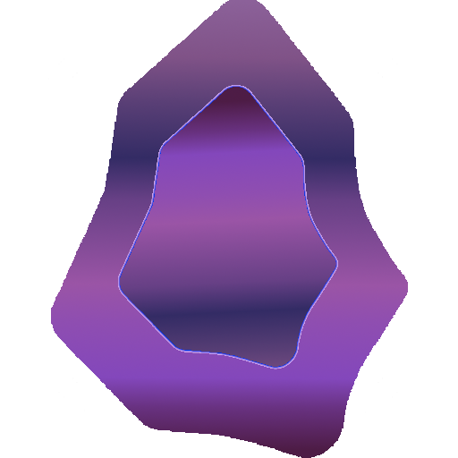 | plaski19.png |
| 59 |  | plaski1.png |
| 60 | 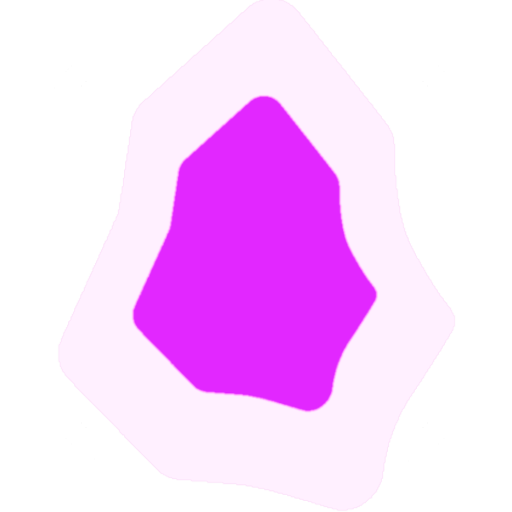 | plaski20.png |
| 61 |  | plaski2.png |
| 62 | 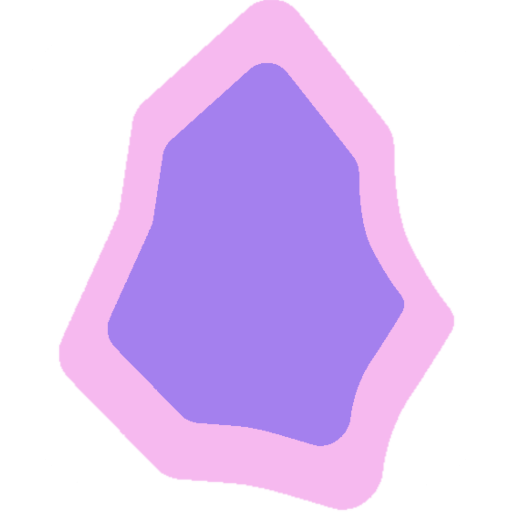 | plaski3.png |
| 63 |  | plaski4.png |
| 64 |  | plaski5.png |
| 65 |  | plaski6.png |
| 66 |  | plaski7.png |
| 67 |  | plaski8.png |
| 68 | 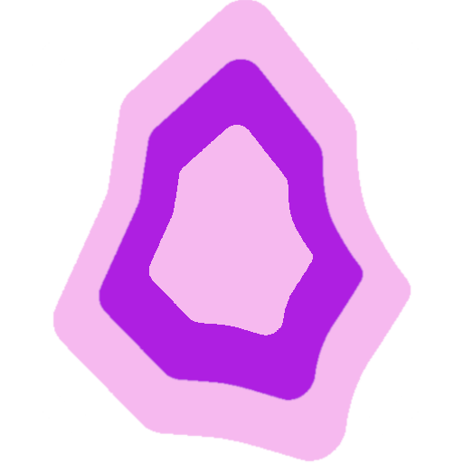 | plaski9.png |
| 74 |  | teal odwrócony1.1.1.png |
| 75 |  | teal odwrócony1.1.2.png |
| 76 |  | teal odwrócony1.1.3.png |
| 77 |  | teal odwrócony1.1.4.png |
| 78 |  | teal odwrócony1.1.5.png |
| 79 |  | teal odwrócony1.1.6.png |
| 80 |  | teal odwrócony1.1.png |
| 81 |  | teal odwrócony1.2.1.1.png |
| 82 |  | teal odwrócony1.2.1.2.png |
| 83 |  | teal odwrócony1.2.1.3.png |
| 84 |  | teal odwrócony1.2.1.png |
| 85 |  | teal odwrócony1.2.2.png |
| 86 |  | teal odwrócony1.2.3.png |
| 87 |  | teal odwrócony1.2.4.png |
| 88 |  | teal odwrócony1.2.5.png |
| 89 |  | teal odwrócony1.2.6.png |
| 90 |  | teal odwrócony1.2.png |
| 91 |  | teal odwrócony1.3.1-2.png |
| 92 |  | teal odwrócony1.3.1-3.png |
| 93 |  | teal odwrócony1.3.1.png |
| 94 |  | teal odwrócony1.png |
